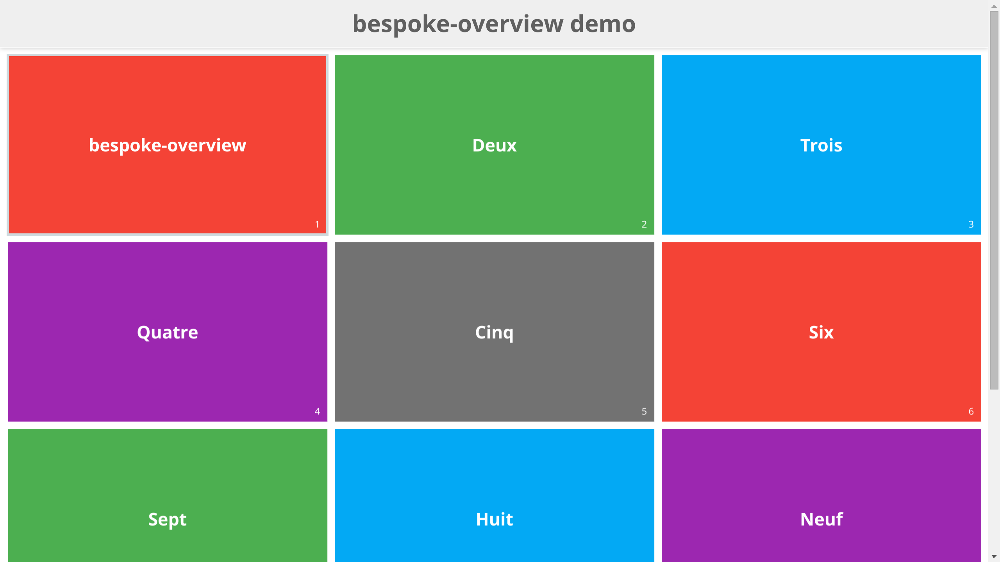

= bespoke-overview
Dan Allen <https://github.com/mojavelinux>
// Settings:
:idprefix:
:idseparator: -
:experimental:
ifdef::env-github[:badges:]
// Variables:
:release-version: v1.0.3
// URIs:
:uri-raw-file-base: https://raw.githubusercontent.com/opendevise/bespoke-overview/{release-version}

ifdef::badges[]
image:https://img.shields.io/npm/v/bespoke-overview.svg[npm package, link=https://www.npmjs.com/package/bespoke-overview]
image:https://img.shields.io/travis/opendevise/bespoke-overview/master.svg[Build Status (Travis CI), link=https://travis-ci.org/opendevise/bespoke-overview]
endif::[]

This plugin adds an overview mode (aka light table or storyboard) to your http://markdalgleish.com/projects/bespoke.js[Bespoke.js] presentation.
In this mode, all the slides become visible and are arranged on a grid.
You activate this mode by pressing the kbd:[o] key.
In addition to giving you a “big picture” view of your presentation, you can use this mode as a navigation aid to jump to an arbitrary slide.



== Example

http://opendevise.github.io/bespoke-overview[View the demo] online.

This repository includes a demo that shows this plugin in action.
To view the demo locally, you first need to clone this repository:

 $ git clone https://github.com/opendevise/bespoke-overview && cd bespoke-overview

Next, install the dependencies inside the project folder using npm:

 $ npm install

Finally, visit the file [path]_demo/index.html_ in your browser to see the plugin in action.
Press the kbd:[o] key to activate overview mode.

== Download

Download the {uri-raw-file-base}/dist/bespoke-overview.min.js[production mode version] or the {uri-raw-file-base}/dist/bespoke-overview.js[development mode version], or use a package manager:

=== npm

 $ npm install bespoke-overview

=== Bower

 $ bower install bespoke-overview

== Usage

This plugin is shipped in a https://github.com/umdjs/umd[UMD format], meaning it is available as a CommonJS/AMD module or as a browser global.

For example, when using CommonJS modules:

```js
var bespoke = require('bespoke'),
  classes = require('bespoke-classes'),
  keys = require('bespoke-keys'),
  overview = require('bespoke-overview');

bespoke.from('.deck', [
  classes(),
  keys(),
  overview()
]);
```

When using browser globals:

```js
bespoke.from('.deck', [
  bespoke.plugins.classes(),
  bespoke.plugins.keys(),
  bespoke.plugins.overview()
]);
```

=== Scaling

If you're using the https://github.com/markdalgleish/bespoke-scale[bespoke-scale] plugin, you _must_ specify the scaling method explicitly to ensure zoom-based scaling is only used for browsers that use WebKit.
This configuration ensures that both the scale and overview plugins work in Internet Explorer 10 and above (IE 10+) (as well as Opera/Presto). _IE 9 and below are not supported by Bespoke.js._

When using CommonJS modules:

```js
var isWebKit = 'webkitAppearance' in document.documentElement.style;

bespoke.from('.deck', [
  // ...
  scale(isWebKit ? 'zoom' : 'transform'),
  overview();
]);
```

When using browser globals:

```js
var bespoke = require('bespoke'),
  // ...
  scale = require('bespoke-scale'),
  overview = require('bespoke-overview'),
  isWebKit = 'webkitAppearance' in document.documentElement.style; 

bespoke.from('.deck', [
  // ...
  bespoke.plugins.scale(isWebKit ? 'zoom' : 'transform'),
  bespoke.plugins.overview();
]);
```

=== Options

The following options are available when registering the bespoke-overview plugin:

columns _(type: integer, default: 3)_::
The number of columns to use for the grid.

margin _(type: number, default: 15)_::
The spacing (in pixels) between the slides in the grid.
This value is scaled by the same amount as the slides in overview mode.

autostart _(type: boolean, default: false)_::
A flag that controls whether the presentation starts in overview mode.

location _(type: boolean, default: false)_::
A flag that controls whether the query string is synchronized with the overview's state.
When this flag is enabled (e.g., `?overview`), the `overview` parameter is added to the query string whenever the overview is open.

counter _(type: boolean, default: false)_::
A flag that controls whether numbers are shown on the slides when in overview mode.
When enabled, adds the `bespoke-overview-counter` class to the deck parent element.
The style of the numbers can be controlled using the `.bespoke-overview-counter .bespoke-slide::after` CSS selector.

title _(type: boolean, default: false)_::
A flag that controls whether the presentation title is shown above the slides in overview mode.
+
When enabled, a `<header class="bespoke-title">` element gets added as the first child of the deck parent element.
The presentation title is enclosed in a `<h1>` element inside the `<header>` element.
The title text is taken from either the `data-title` attribute on the deck parent or `document.title`.
+
The style of the `<header>` and `<h1>` elements can be controlled using the `.bespoke-overview .bespoke-title` and `.bespoke-overview .bespoke-title h1` CSS selectors, respectively.

scaleTitle _(type: boolean, default: true)_::
A flag that controls whether the title element is scaled proportionally to the scaling of the slides.

==== Options example

Here's an example showing most of the options in use:

```js
bespoke.from('.deck', [
  classes(),
  keys(),
  overview({ columns: 2, margin: 10, autostart: true, location: true, counter: true, title: true })
]);
```

=== Plugin dependencies

The https://www.npmjs.com/package/bespoke-classes[bespoke-classes] plugin must be enabled in order for the bespoke-overview plugin to function properly.
A theme (either one that is published or a custom one) is also recommended.

=== Plugin order

The overview plugin should be applied in the following order relative to other plugins:

* bespoke-classes
* bespoke-scale
* *bespoke-overview*
* bespoke-bullets

The placement of other plugins doesn't cause any known problems.

== How it works

When the trigger key is pressed (i.e., kbd:[o]), all the slides in the presentation become visible and are arranged on a grid.
The number of columns in the grid is controlled by the `columns` option passed to the plugin (e.g., `overview({ columns: 4 })`, which defaults to 3.
The number of rows is determined by the number of slides in the presentation.
The browser's scrollbar will appear on the right side of the screen in overview mode, which can be used to bring slides into view that spill outside the visible area.

When the plugin is loaded, it prepends a collection of built-in styles to the top of the HTML page, which are used to control the default behavior of the overview mode.
These styles can be overridden or customized.

When the overview is activated, the `bespoke-overview` class is added to the deck parent element (the element that has the `bespoke-parent` class).
Thanks to the built-in styles, all the slides will become visible (pending any slide transitions) when the `bespoke-overview` class is added to the deck parent.
Next, a transform is applied to each slide to arrange the slides in a grid layout.
The transform consists of the following two properties:

translate::
sets the x, y coordinates of the slide

scale::
resizes the slide to fit within the grid

TIP: This plugin works both with and without the bespoke-scale plugin enabled (using either scale method).

After the overview is activated, the selected slide will automatically be scrolled into view.
A border will appear around the selected slide.
You can use the cursor to navigate through the slides in overview mode.
You'll see the selection border advance as you use the left and right arrows (kbd:[<-] and kbd:[->], respectively).
The selected slide will be scrolled into view automatically, if necessary.

NOTE: For browsers that honor the CSS https://developer.mozilla.org/en-US/docs/Web/CSS/scroll-behavior[scroll-behavior] property (e.g., Firefox), the slides will be scrolled into view smoothly.

WARNING: In overview mode, you won't be able to scroll up and down on a mobile device using touch events due to how the bespoke-touch plugin works (it intercepts the default behavior by calling `preventDefault()`).
However, you can still navigate from slide to slide using a horizontal (left and right) swipe gesture.

There are two ways to leave overview mode.
When one of the trigger keys is pressed (i.e., kbd:[o] or kbd:[enter]), the presentation will exit from overview mode and show the selected slide in the normal (single slide) mode.
If, instead, one of the slides is clicked, the presentation will return to the normal (single slide) mode after advancing to the slide that received the click.

When overview mode is deactivated, the `bespoke-overview` class is removed from the deck parent, the scrollbar is hidden, the slides are temporarily repositioned to account for the deactivation of the scrollbar and, finally, the manual transform on each slide is removed.
(If there's a scroll offset when the overview mode is deactivated, it will appear as though the selected slide transitions from its position in the overview to its position in slide mode thanks to an interim translation of its position).

== Transitions

The bespoke-overview plugin gives you fine-grained control over the transition going to and from overview mode.
The `bespoke-overview-to` class is added to the deck parent when the overview is activated and remains there until all slide transitions, if any, are complete.
Conversely, the `bespoke-overview-from` class is added to the deck parent when the overview is deactivated and remains there until all slide transitions, if any, are complete.

IMPORTANT: The transform origin is assumed to be 50% 50% (i.e., the center of the slide).

NOTE: The `bespoke-overview` class is immediately removed from the deck parent element when the overview mode is deactivated, whereas the `bespoke-overview-from` class remains on the element until all slide transitions, if any, are complete.

TIP: If you want to defer a style change until the transition into overview mode is complete, use the CSS selector `.bespoke-overview:not(.bespoke-overview-to)`.

.Understanding z-index values
****
If each slide is enclosed in a wrapper element that has a transform applied to it (e.g., when bespoke-scale is enabled and configured to use the transform strategy), the z-index setting on a slide will have no effect on the visual stacking order.
This happens because a wrapper element with a transform applied creates a new stacking context, which limits the scope of the z-index setting (i.e., the value only applies relative to other elements in the stacking context).
Under these conditions, the active slide may not appear on top when transitioning out of overview mode regardless of the z-index setting.
****

.Hiding the scrollbar
[TIP]
====
To make the transitions faster and smoother in WebKit and IE 10+, you can disable the visibility of the scrollbar.
To do so, add the following style rules to your CSS:

```css
.bespoke-overview::-webkit-scrollbar {
  width: 0;
}

.bespoke-overview {
  -ms-overflow-style: none; /* or -ms-autohiding-scrollbar */
}
```
====

=== Default transitions

By default, overview mode uses the same transitions that are applied to the slides themselves.
If you do not use transitions on the slides in your presentation, then transitions will not be used when you toggle overview mode.

=== Disabling transitions

If you do have transitions on your slides (particularly on `transform`), you can disable transitions when going to and from overview mode using the following styles in your CSS file:

```css
.bespoke-overview-to .bespoke-slide,
.bespoke-overview-from .bespoke-slide {
  -webkit-transition: none;
  transition: none;
}
```

=== Custom transitions

Rather than disabling transitions, you can use the `bespoke-overview-to` and `bespoke-overview-from` classes to create distinct transitions when entering and leaving overview mode.

```css
.bespoke-overview-to .bespoke-slide {
  -webkit-transition: -webkit-transform 0.5s ease-out, opacity 0.5s ease-in-out 0.4s;
  transition: transform 0.5s ease-out, opacity 0.5s ease-in-out 0.4s;
}

.bespoke-overview-from .bespoke-slide {
  -webkit-transition: -webkit-transform 0.5s ease-in-out 0.05s, opacity 0.15s ease-in-out;
  transition: transform 0.5s ease-in-out 0.05s, opacity 0.15s ease-in-out;
}
```

=== Transitioning the title

If you enable the title, you can also use the `bespoke-overview-to` and `bespoke-overview-from` to control the transition on the title when entering and leaving overview mode.

```css
.bespoke-title {
  opacity: 0;
}

.bespoke-overview .bespoke-title {
  opacity: 1;
}

.bespoke-overview-to .bespoke-title {
  visibility: visible;
  -webkit-transition: opacity 0.5s ease-in-out 0.4s;
  transition: opacity 0.5s ease-in-out 0.4s;
}

.bespoke-overview-from .bespoke-title {
  visibility: visible;
  -webkit-transition: opacity 0.15s ease-in-out;
  transition: opacity 0.15s ease-in-out;
}
```

IMPORTANT: The `visibility` property is important as it overrides the built-in behavior necessary to work when transitions on the title are not used.

== Events

The bespoke-overview plugin responds to the following events:

[cols="1s,4"]
|===
|Event Name |Description

|overview
|Toggles the overview.
If the overview is open, it is closed.
If the overview is closed, it is opened.
|===

You trigger an event using the built-in `fire` method on the deck instance anywhere within a plugin.
For example, to toggle the overview, invoke:

```js
deck.fire('overview');
```

== License

http://en.wikipedia.org/wiki/MIT_License[MIT License]
